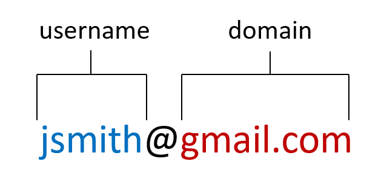

<!-- README.md is generated from README.Rmd. Please edit that file -->

# filast

With the **filast** package, any **Python** user can fill in missing emails in their CRM. 

Emails are compsed of two parts: a username, and a domain. 



There are free email domains like gmail.com or aol.com, and company domains like oracle.com or toshiba.com.

The usernames with free email domains are very unrestricted. For example, John Smith could chose to make his email jsmith@gmail.com or j.smith88@gmail.com. Whereas, at company's it is common practice to issue employees email addresses with the same username syntax. That's what makes them predictable.

The majority of company email usernames are composed of a combination of some the following:
* first name
* last name
* first initial
* last initial
* dot
* underscore

The most common combination is first initial + last name; or **filast** (hence the name of the package).

If email, first and last name are populated for a contact, there's a good chance their email username syntax can be predicted. 

| Email            | First Name | Last Name |
| ---------------- | ---------- | --------- | 
| jsmith@gmail.com | John       | Smith     | 

From those 3 base fields, this package extracts further information:

| Email            | First Name | Last Name | First Initial | Last Initial | Dot | Underscore | Username |
| ---------------- | ---------- | --------- | ------------- | ------------ | --- | ---------- | -------- |
| jsmith@gmail.com | john       | smith     | j             | s            | .   | _          | jsmith   |

Then, it determine the position of the names, initials, and symbols in the email username.


If a name, initial, or symbol does not exist, a 0 is returned.

| First Name | Last Name | First Initial | Last Initial | Dot | Underscore |
| ---------- | --------- | ------------- | ------------ | --- | ---------- |
| 0          | 2         | 1             | 0            | 0   | 0          | 

Reading the column values from left to right reveals the username syntax code (021000 for this example). There are twenty possible codes from the six names, initials, and symbols and they are listed [here](https://github.com/jvanzalk/filast/blob/main/username_syntax_codes.csv).

If multiple contacts are possesed for a company, the username and domain can be predicted using the functions below.

### Determining A Company's Email Username Syntax

``` python
username(df, co_name, first_name, last_name, email, contacts=5, syntax_pct=60)
```
#### Arguments

**df:** data frame of contacts

**co_name:** column name for data frame column that contains company names. Must be enclosed in quotation marks.

**first_name:** column name for data frame column that contains the contacts first names. Must be enclosed in quotation marks.

**last_name:** column name for data frame column that contains the contacts last names. Must be enclosed in quotation marks.

**email:** column name for data frame column that contains the contacts emails. Must be enclosed in quotation marks.

**contacts:** minimum number of contacts that a company must have for a definite decision on the username. Default is 5.

**syntax_pct:** minimum percentage of contacts with the same username syntax that a company must have for a definite decision on the username. Default is 60.

### Determining A Company's Email Domain

``` python
domain(df, co_name, email, contacts=5, domain_pct=80, co_domain_match_pct=60)
```
#### Arguments

**df:** data frame of contacts

**co_name:** column name for data frame column that contains company names. Must be enclosed in quotation marks.

**email:** column name for data frame column that contains the contacts emails. Must be enclosed in quotation marks.

**contacts:** minimum number of contacts that a company must have for a definite decision on the domain. Default is 5.

**domain_pct:** minimum percentage of contacts with the same domain that a company must have for a definite decision on the domain. Default is 80.

**co_domain_match_pct:** minimum percentage match between company name and domain for a definite decision on the domain. Default is 60.

## Installation

The **filast** package can be installed directly from **GitHub** with

``` python
pip install git+https://github.com/jvanzalk/filast.git
from filast import companytools
```

If you encounter a bug, have usage questions, or want to share ideas to
make this package better, feel free to file an
[issue]().

## License
