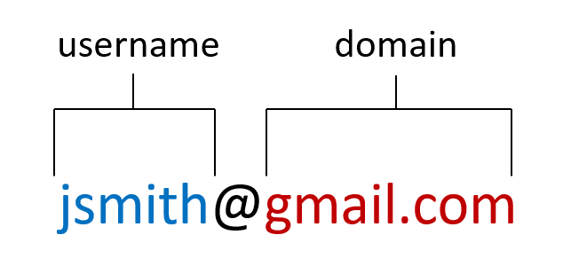

<!-- README.md is generated from README.Rmd. Please edit that file -->

# filast

With the **filast** package, any **Python** user can fill in missing emails in their CRM. 

Emails are compsed of two parts: a username, and a domain. 



The majority of email usernames are composed of a combination of the following:
* first name
* last name
* first initial
* last initial
* dot
* underscore

The most common combination is first initial + last name; or **filast** (hence the name of the package).

If you have the email, first and last name for a contact, you can determine what their email username syntax is. 

| Email            | First Name | Last Name |
| ---------------- | ---------- | --------- | 
| jsmith@gmail.com | John       | Smith     | 

We can extract information from the 3 base fields to produce a dataframe like this:

| Email            | First Name | Last Name | First Initial | Last Initial | Dot | Underscore | Username |
| ---------------- | ---------- | --------- | ------------- | ------------ | --- | ---------- | -------- |
| jsmith@gmail.com | john       | smith     | j             | s            | .   | _          | jsmith   |

Then, we can determine the position of the names, initial and common symbols in the email username.


If the ___ does not exist, we leave a 0.

| First Name | Last Name | First Initial | Last Initial | Dot | Underscore |
| ---------- | --------- | ------------- | ------------ | --- | ---------- |
| 0          | 2         | 1             | 0            | 0   | 0          | 


### Determining A Company's Email Domain

### Determining A Company's Email Username Syntax

## Installation

The **filast** package can be installed directly from **GitHub** with

``` python
pip install git+https://github.com/jvanzalk/filast.git
from filast import companytools
```

If you encounter a bug, have usage questions, or want to share ideas to
make this package better, feel free to file an
[issue]().

## License
